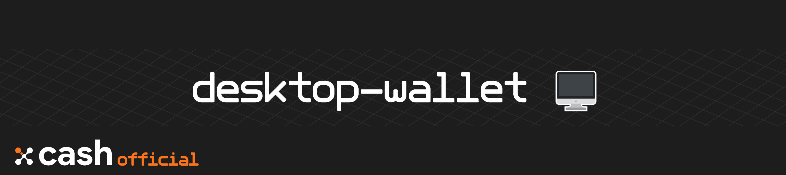

<div align=middle>

<a align="center" href="https://x-network.io/xcash"></a>

[](https://github.com/X-CASH-official-team/desktop-wallet/releases)
[](https://gitter.im/xcash-foundation/xcash-core?utm_source=badge&utm_medium=badge&utm_campaign=pr-badge)
[](https://discordapp.com/invite/4CAahnd)
[](https://opensource.org/licenses/MIT)

</div>

# X-Cash GUI Desktop Wallet

🖥 **Securely store and manage your XCASH** !  
X-Cash multi-platform GUI wallet. Send XCASH publicly or privately easily, manage your wallets, and more !  
*Made with **angular** & **electronJS**.*  

## Table of Contents  
- [Table of Contents](#table-of-contents)
- [Download](#download)
- [Features](#features)
- [License](#license)
- [Contributing](#contributing)
- [Documentation](#documentation)
- [Security](#security)
- [System Requirements](#system-requirements)
- [Installing from source](#installing-from-source)

## Download

Check the [latest release](https://github.com/X-CASH-official-team/desktop-wallet/releases)

## Features

**Improved security**  
When creating a new wallet, the software will verify that you have correctly noted your mnemonic seed.


**Multi-wallet Dashboard**  
From the dashboard, you can import, check, and manage all your XCASH's wallets.


**Address book**  
Manage your contacts and add wallet addresses from recurrent transfers.


**Vote for your delegate** *(in development)* 
Vote for your desired delegate, instantaneously from your wallet! 

## License

**X-Cash GUI Wallet is an open-source project managed by the X-Cash Foundation**.  
We are operating under the [MIT License](LICENSE).

## Contributing

**Thank you for thinking of contributing! 😃**   
If you want to help out, check [CONTRIBUTING](https://github.com/X-CASH-official/.github/blob/master/CONTRIBUTING.md) for a set of guidelines and check our [opened issues](https://github.com/X-CASH-official/desktop-wallet/issues).

## Documentation

We are hosting our documentation on **GitBook** 👉 [**docs.xcash.foundation**](https://docs.xcash.foundation/)

> You can contribute directly on our [`gitbook-docs`](https://github.com/X-CASH-official/gitbook-docs) repository.

## Security 

If you discover a security vulnerability, please send an e-mail to [security@xcash.foundation](mailto:security@xcash.foundation).  
All security vulnerabilities concerning the X-Cash blockchain will be promply addressed.

## System Requirements
 
Currently support **Windows**, **OS X**, and **Linux** operating systems.

## Installing from source

### Dependencies

> The following table summarizes the tools and libraries required to run the GUI desktop wallet.

| Dependencies                                 | Min. version  | Ubuntu package            |
| -------------------------------------------- | ------------- | ------------------------- |
| Node.js                                      | 13             |  install from binaries    | 
| Angular                                      | 8             |  install from NPM         |
| XCASH_DPOPS                                  | latest version | [build from source](https://github.com/X-CASH-official/XCASH_DPOPS) or [download the latest release](https://github.com/X-CASH-official/X-CASH/releases)

### Requirements

#### Node.js 13

To download, you can go to Node.js official [release page](https://nodejs.org/en/), or run the following command. 
```bash
curl -sL https://deb.nodesource.com/setup_13.x | sudo -E bash -
sudo apt update
sudo apt install -y nodejs
```

#### npm

> Note if your installing on a root account, you need to run these additional commands before upgrading
```shell
npm config set user 0 
npm config set unsafe-perm true
```

Update npm globally
```shell
npm install -g npm
```

#### Angular

Install the latest version of Angular globally
```shell  
npm install -g @angular/cli@latest
```

### Develop

#### Clone repository
```shell
git clone https://github.com/X-CASH-official/desktop-wallet.git
``` 

#### Install dependencies

Go to the folder where you cloned the repository and run:
```shell
npm install
```

#### Build

<details><summary> Build commands </summary>

```bash
# Build the wallet using JIT compilation mode run
npm run start

# Build using a production mode run
npm run build

# Build electron application for production (Windows)
npm run package-win

# Build electron application for production (OS X)
npm run package-mac

# Build electron application installer for production (OS X)
npm run create-installer-mac

# Build electron application for production (Linux)
npm run package-linux
```

</details>